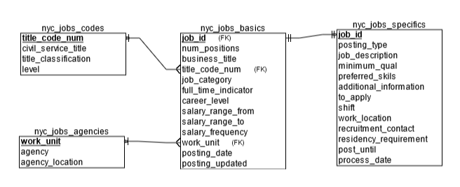

## Overview

The dataset our team has chosen to use for this project is a table of job postings on https://data.cityofnewyork.us/ provided by the Department of Citywide Administrative Services (DCAS). A description taken from the [source](https://dev.socrata.com/foundry/data.cityofnewyork.us/kpav-sd4t) is below:

```This dataset contains current job postings available on the City of New York’s official jobs site (http://www.nyc.gov/html/careers/html/search/search.shtml). Internal postings available to city employees and external postings available to the general public are included.```

The original table is comprised of 30 columns, but in order to make the data more digestible and easier to read, we've broken this table down into 4 smaller ones; below is an ERD of our relational database model. 



To keep things relevant, here are the fields we'll be going through as part of this exploratory analysis:

- `nyc_jobs_basics.job_id`: The job opening identification (“Job ID”) number that corresponds to and represents a job posting notice published on behalf of a New York City agency. 
- `nyc_jobs_basics.work_unit` (agency): Name of the New York City agency (“agency” or “hiring agency”) where a job vacancy exists.
- `nyc_jobs_specifics.posting_type`: Identifies whether a job posting is an Internal or External posting. Internal postings are available to City employees only and external postings are available to the general public.
- `nyc_jobs_basics.job_category` = The occupational group in which the posted job belongs, such as: Administration & Human Resources; Communications & Intergovernmental Affairs; Constituent Services & Community Programs; Engineering, Architecture, & Planning; Finance, Accounting, & Procurement; Health; Technology, Data & Innovation; Legal Affairs; Building Operations & Maintenance; Policy, Research & Analysis; Public Safety, Inspections, & Enforcement; Social Services
- `nyc_jobs_basics.full_time_indicator`: "This denotes whether the job is a full time or part time employment; F - Full time; P - Part time"
- `nyc_jobs_basics.career_level`: "This denotes the career level of the job. The possible career levels are:; Student; Entry-level; Experienced (non-manager); Manager; Executive"
- `nyc_jobs_basics.salary_range_from`: The lowest salary on a job posting for a position within the salary band for the related civil service title.
- `nyc_jobs_basics.salary_range_to`: The highest salary on a job posting for a position within the salary band for the related civil service title.
- `nyc_jobs_basics.salary_frequency`: The frequency of proposed salary.  Possible salary frequency values include “hourly”, “daily”, and “annual”. 
- `nyc_jobs_basics.posting_date`: The date and time that a job vacancy was posted in MM/DD/YY format.

## Exploration

First, we must connect to the database; we've chosen to use Azure as our hosting service.

```{r azure_connect}
library(plyr)
library(tidyverse)
library(odbc)
library(DBI)
library(keyring)
library(ggplot2)

if (!("Overview8909" %in% as_vector(key_list()[2]))) {
  key_set("Project3SQL","Overview8909")
}
```

```{r pull_data}
my_connection <- dbConnect(drv = odbc::odbc(),
                           Driver = "ODBC Driver 18 for SQL Server",
                           server = "tcp:data607project3server.database.windows.net,1433",
                           database = "Data 607 Project 3 Database",
                           uid = "Overview8909",
                           pwd = key_get("Project3SQL","Overview8909"),
                           encoding = "latin1"
                           )

nyc_jobs_basics_sql <- "select * from nyc_jobs_basics"
nyc_jobs_agencies_sql <- "select * from nyc_jobs_agencies"
nyc_jobs_codes_sql <- "select * from nyc_jobs_codes"
nyc_jobs_specifics_sql <- "select * from nyc_jobs_specifics"

nyc_jobs_basics <- dbGetQuery(my_connection, nyc_jobs_basics_sql)
nyc_jobs_agencies <- dbGetQuery(my_connection, nyc_jobs_agencies_sql)
nyc_jobs_codes <- dbGetQuery(my_connection, nyc_jobs_codes_sql)
nyc_jobs_specifics <- dbGetQuery(my_connection, nyc_jobs_specifics_sql)

dbDisconnect(my_connection)
```

To start, we'll first just get an overall count of the data.

```{r counts}
overall_count <- nyc_jobs_basics |> 
  dplyr::summarise(count = n())

sprintf("There are %i jobs currently posted.", overall_count$count)
```

As of Thursday, March 17, there are 3,260 jobs currently available. 

How can we break this down further?

### Agency Posted

What agencies are posting these jobs?

```{r agency}
agency_count <- nyc_jobs_basics |> 
  dplyr::summarise(count = n_distinct(work_unit))

sprintf("There are %i agencies.", agency_count$count)

counts_by_agency <- nyc_jobs_basics |> 
  group_by(work_unit) |>
  dplyr::summarise(count = n(),
            percent = 100 * n()/nrow(nyc_jobs_basics),
            .groups = 'drop') |>
  arrange(desc(count))

head(counts_by_agency, 10)
```

In total, there are 1,048 different agencies and no agency is more prevalent in job postings than another. The fact that the largest one only has 43 current job postings out of 3k+ (\~1%) shows that it's an extremely diverse collection of jobs.

### Posting Type

Are a majority of these listings internal or external?

```{r posting_type}
counts_by_posting_type <- nyc_jobs_specifics |> 
  group_by(posting_type) |>
  dplyr::summarise(count = n(),
            percent = 100 * n()/nrow(nyc_jobs_basics),
            .groups = 'drop') |>
  arrange(desc(count))

head(counts_by_posting_type)
```

Pretty close to 50/50, although internal is slightly higher at 55% vs. external's 45%.

### Job Category

What job categories do these postings fall under?

```{r job_category}
category_count <- nyc_jobs_basics |> 
  dplyr::summarise(count = n_distinct(job_category))

sprintf("There are %i job categories", category_count$count)

counts_by_job_category <- nyc_jobs_basics |> 
  group_by(job_category) |>
  dplyr::summarise(count = n(),
            percent = 100 * n()/nrow(nyc_jobs_basics),
            .groups = 'drop') |>
  arrange(desc(count))

head(counts_by_job_category, 10)
```

In total, there are 192 distinct job categories. Of these, we can see that the most common categories are `Engineering, Architecture, & Planning` (\~13%), `Technology, Data, & Innovation` (\~8%), `Legal Affairs` (7%), and `Administration & Human Resources` (\~6%). 

Circling back to our goal of finding data science related jobs and skills, one way to hone in on this is to use category as a way to see what how many of these postings fall into categories with the words `analysis`, `analytics`, `data`, or `statistics`? 

```{r relevant_categories}
to_find <- c("Data", "Analysis", "Analytics", "Statistics")
matches <- unique(grep(paste(to_find, collapse="|"), nyc_jobs_basics$job_category, value=TRUE))

relevant_categories <- filter(nyc_jobs_basics, job_category %in% matches)

overall_relevant_count <- relevant_categories |> 
  dplyr::summarise(count = n())

counts_by_relevant_job_category <- relevant_categories |> 
  group_by(job_category) |>
  dplyr::summarise(count = n(),
            percent = 100 * n()/nrow(relevant_categories),
            percent_of_total = 100 * n()/nrow(nyc_jobs_basics),
            .groups = 'drop') |>
  arrange(desc(count))

sprintf("There are %i jobs currently posted within a relevant category.", overall_relevant_count$count)

head(counts_by_relevant_job_category, 20)
```

Here, we can see there are 784 jobs currently posted with a category containing one of our keywords with `Policy, Research & Analysis` bubbling up as the second most popular relevant category at 85 postings (\~11% of this subset, \~3% of total).

### Full/Part Time

What is the breakdown of these jobs by full vs. part time?

```{r full_part_time}
counts_by_full_part_time <- nyc_jobs_basics |> 
  group_by(full_time_indicator) |>
  dplyr::summarise(count = n(),
            percent = 100 * n()/nrow(nyc_jobs_basics),
            .groups = 'drop') |>
  arrange(desc(count))

head(counts_by_full_part_time)
```

It seems like there are a few rows where this isn't filled out, but a vast majority of the jobs posted are full-time listings.

### Career Level

What is the breakdown of these jobs by career level?

```{r career_level}
counts_by_career_level <- nyc_jobs_basics |> 
  group_by(career_level) |>
  dplyr::summarise(count = n(),
            percent = 100 * n()/nrow(nyc_jobs_basics),
            .groups = 'drop') |>
  arrange(desc(count))

head(counts_by_career_level)
```

Interestingly, 72% (2.3k) of these jobs are for `Experienced (non-manager)` roles. 

### Salary Information

How do these jobs look in terms of salaray?

#### Frequency

We can start with frequency -- how often are folks paid for these roles?

```{r salary_frequency}
counts_by_salary_frequency <- nyc_jobs_basics |> 
  group_by(salary_frequency) |>
  dplyr::summarise(count = n(),
            percent = 100 * n()/nrow(nyc_jobs_basics),
            .groups = 'drop') |>
  arrange(desc(count))

head(counts_by_salary_frequency)
```

A vast majority at \~89% (2.9k) are annual, although in order to properly compare compensation, we'll have to adjust the hourly and daily rates up to an annual value. We'll assume 40 hour weeks and 52 weeks in a year for the hourly folks and 365 days a year for the daily ones. I'll also round these adjusted salary ranges to the nearest $10,000.

```{r adjust_salary_frequency}
salary_from_adjusted <- c()
salary_to_adjusted <- c()

freq <- ""

for(i in 1:nrow(nyc_jobs_basics)) {
    freq <- nyc_jobs_basics$salary_frequency[i]
    if (freq == "Annual") {
      salary_from_adjusted <- append(salary_from_adjusted, round_any(nyc_jobs_basics$salary_range_from[i], 10000))
      salary_to_adjusted <- append(salary_to_adjusted, round_any(nyc_jobs_basics$salary_range_to[i], 10000))
    } else if (freq == "Hourly") {
      salary_from_adjusted <- append(salary_from_adjusted, round_any(nyc_jobs_basics$salary_range_from[i] * 40 * 52, 10000))
      salary_to_adjusted <- append(salary_to_adjusted, round_any(nyc_jobs_basics$salary_range_to[i] * 40 * 52, 10000))
    } else { # this means it's daily
      salary_from_adjusted <- append(salary_from_adjusted, round_any(nyc_jobs_basics$salary_range_from[i] * 365, 10000))
      salary_to_adjusted <- append(salary_to_adjusted, round_any(nyc_jobs_basics$salary_range_to[i] * 365, 10000))
    }
}

nyc_jobs_basics$salary_from_adjusted <- salary_from_adjusted
nyc_jobs_basics$salary_to_adjusted <- salary_to_adjusted

head(nyc_jobs_basics)
```

Now with this, how do the salary ranges look? Let's start with the beginning band (from).

```{r salary_from_chart}
count_by_salary_from <- nyc_jobs_basics |> 
  group_by(salary_from_adjusted, salary_frequency) |>
  dplyr::summarise(count = n(),
                   percent = 100 * n()/nrow(nyc_jobs_basics),
            .groups = 'drop') |>
  arrange(desc(count))

salary_from_bar <-ggplot(data=count_by_salary_from
                   , aes(x=salary_from_adjusted
                         , y=count)) + 
  geom_bar(stat="identity", position=position_dodge()) + 
  scale_fill_brewer(palette="Paired")+
  theme_minimal()

salary_from_summary <- nyc_jobs_basics |>
  dplyr::summarise(mean = mean(salary_from_adjusted),
                   median = median(salary_from_adjusted),
                   min = min(salary_from_adjusted),
                   max = max(salary_from_adjusted))

salary_from_summary

salary_from_bar
```

The data looks to be right skewed here with a center around \~\$60k and a high of \~\$230k. The mean and median are close but not quite the same so it's not a perfectly normal distribution. What about the to (high) portion of the salary range?


```{r salary_to_chart}
count_by_salary_to <- nyc_jobs_basics |> 
  group_by(salary_to_adjusted, salary_frequency) |>
  dplyr::summarise(count = n(),
            percent = 100 * n()/nrow(nyc_jobs_basics),
            .groups = 'drop') |>
  arrange(desc(count))

salary_to_bar <-ggplot(data=count_by_salary_to
                   , aes(x=salary_to_adjusted
                         , y=count)) + 
  geom_bar(stat="identity", position=position_dodge()) + 
  scale_fill_brewer(palette="Paired")+
  theme_minimal()

salary_to_summary <- nyc_jobs_basics |>
  dplyr::summarise(mean = mean(salary_to_adjusted),
                   median = median(salary_to_adjusted),
                   min = min(salary_to_adjusted),
                   max = max(salary_to_adjusted))

salary_to_summary

salary_to_bar
```
This one looks less like a bell-curve (still right-skewed though) and seems to have a high frequency at \~\$60k as well, however there seems to be more jobs with rates at the tail ends of the spectrum. We can see that the max here goes up to \~\$250k with more activity in the \~\$100k+ range. The mean and median here have been brought up though at \$88k and \$80k respectively while the minimum is also at \$30k; in general, these rates pay more as they're the at the higher end of the spectrum.

What does salary look like if we assume most folks get the middle point of each posted range?

```{r salary_avg_chart}
nyc_jobs_basics$salary_mid_adjusted <- (nyc_jobs_basics$salary_to_adjusted + nyc_jobs_basics$salary_from_adjusted) / 2

count_by_salary_mid <- nyc_jobs_basics |> 
  group_by(salary_mid_adjusted, salary_frequency) |>
  dplyr::summarise(count = n(),
            percent = 100 * n()/nrow(nyc_jobs_basics),
            .groups = 'drop') |>
  arrange(desc(count))

salary_mid_bar <-ggplot(data=count_by_salary_mid
                   , aes(x=salary_mid_adjusted
                         , y=count)) + 
  geom_bar(stat="identity", position=position_dodge()) + 
  scale_fill_brewer(palette="Paired")+
  theme_minimal()

salary_mid_summary <- nyc_jobs_basics |>
  dplyr::summarise(mean = mean(salary_mid_adjusted),
                   median = median(salary_mid_adjusted),
                   min = min(salary_mid_adjusted),
                   max = max(salary_mid_adjusted))

salary_mid_summary

salary_mid_bar
```
Using the mid-point, we can see that the curve now peaks at \~\$65k. It's still a bit right-skewed with a tail trailing off at \~\$230k as well while the mean and median now are closer at ~\$\77k and \~\$75k respectively..

### Post Date

In this data set, when were these jobs posted?

```{r post_date}
nyc_jobs_basics$posting_date <- as.Date(nyc_jobs_basics$posting_date, "%m/%d/%Y")

count_by_date <- nyc_jobs_basics |> 
  group_by(year = format(posting_date, '%Y')) |>
  dplyr::summarise(count = n(),
            percent = 100 * n()/nrow(nyc_jobs_basics),
            .groups = 'drop') |>
  arrange(desc(count))

head(count_by_date, 10)
```

It looks like a majority of these job listings are from this year and last year, however some of them are even from 2014. For the most part though, it seems like they're mostly recent as 48% of them are from this year, but it's only been \~3.5 months as it's only March.

